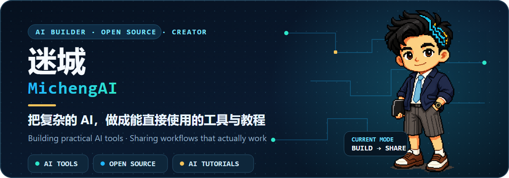

  

  
  
  

  AI 工具开发者与内容创作者，专注把复杂能力做成普通人和团队真正能用的工具、工作流与教程。

## 🚀 精选开源项目

<table align="center" width="100%">
  <thead>
    <tr>
      <th width="50%" align="left">项目</th>
      <th width="50%" align="left">项目</th>
    </tr>
  </thead>
  <tbody>
    <tr>
      <td width="50%" valign="top">
        <strong>01 · <a href="https://github.com/MichengAI/dsh-codex-ui">DSH Codex UI</a></strong> 
        Codex UI 插件，专注完整交互体验与细节还原。 
        <code>TypeScript</code> · <a href="https://github.com/MichengAI/dsh-codex-ui">github.com/MichengAI/dsh-codex-ui</a>
      </td>
      <td width="50%" valign="top">
        <strong>02 · <a href="https://github.com/MichengAI/dsh-codex-desktop">DSH Codex Desktop</a></strong> 
        跨平台桌面版本，无需预装复杂环境，开箱即用。 
        <code>TypeScript</code> · <a href="https://github.com/MichengAI/dsh-codex-desktop">github.com/MichengAI/dsh-codex-desktop</a>
      </td>
    </tr>
    <tr>
      <td width="50%" valign="top">
        <strong>03 · <a href="https://github.com/MichengAI/dsh-skills-manager">DSH Skills Manager</a></strong> 
        可视化管理 DeepSeek Harness Skills 的桌面插件。 
        <code>JavaScript</code> · <a href="https://github.com/MichengAI/dsh-skills-manager">github.com/MichengAI/dsh-skills-manager</a>
      </td>
      <td width="50%" valign="top">
        <strong>04 · <a href="https://github.com/MichengAI/dsh-agency-agents">DSH Agency Agents</a></strong> 
        面向不同行业场景的 Agent 集合与实践样例。 
        <code>JavaScript</code> · <a href="https://github.com/MichengAI/dsh-agency-agents">github.com/MichengAI/dsh-agency-agents</a>
      </td>
    </tr>
    <tr>
      <td width="50%" valign="top">
        <strong>05 · <a href="https://github.com/MichengAI/dsh-archive-manager">DSH Archive Manager</a></strong> 
        让历史会话更容易查找、归档和维护。 
        <code>JavaScript</code> · <a href="https://github.com/MichengAI/dsh-archive-manager">github.com/MichengAI/dsh-archive-manager</a>
      </td>
      <td width="50%" valign="top">
        <strong>06 · <a href="https://github.com/MichengAI/dsh-automation">DSH Automation</a></strong> 
        为 DeepSeek Harness 提供定时与自动化任务能力。 
        <code>JavaScript</code> · <a href="https://github.com/MichengAI/dsh-automation">github.com/MichengAI/dsh-automation</a>
      </td>
    </tr>
    <tr>
      <td colspan="2" width="100%" valign="top">
        <strong>07 · <a href="https://github.com/MichengAI/dsh-im-connect">DSH IM Connect</a></strong> 
        连接微信、企业微信、钉钉、QQ、飞书等 IM 场景。 
        <code>JavaScript</code> · <a href="https://github.com/MichengAI/dsh-im-connect">github.com/MichengAI/dsh-im-connect</a>
      </td>
    </tr>
  </tbody>
</table>

## 🧭 当前方向

**AI 工具产品化** · **DeepSeek Harness 生态** · **Skills 与自动化** · **AI 教程与知识库**

  
  
  
  
  

  <strong>Build something useful. Then explain it clearly.</strong> 
  欢迎关注项目、提交 Issue，或在感兴趣的仓库里交流。

